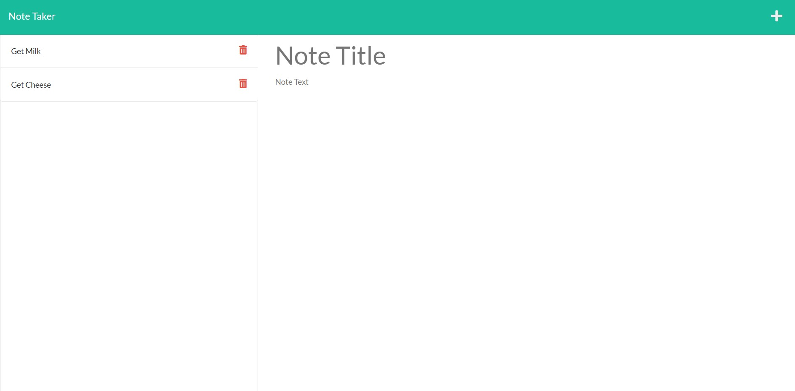

# Team_Profile_Generator

## Description

This project was done in order to get practice working with backend Javascript operations such as get and post. The created program acts as a note taking site, allowing users to write down and remove notes. During this project I learned how to simulate running a server on my local mahcine and how to manipulate data using backend operations such as get and post.

## Installation

The modules Inquirer (version 8.2.4), Express, and UUID must be installed using npm and the runtime Node.js must be installed.

## Usage

This project can be used to write and remove notes to a webpage. To access the note taking portion of the website the user must click the 'Get Started' button on the home page. This home page will be the page that users will be rerouted to if they enter an invalid URL extension for the website. Upon entering the note taking page the user will see any previously entered notes, if they exist, as thier titles only on the left in a sidebar side and a large area on the right side in which to enter both a new note's title and text. If a user wishes to save an entered note, they must click the floppy disk icon that appears in the upper right hand corner. Notes cannot be saved unless they have both title and body text. If a user wishes to discard thier current work on a note and create a new, blank note, they must click the plus sign symbol that appears in the upper right hand corner of the screen. If a user wishes to pull up the full text of a note from the sidebar, they must click on the note's title text in the sidebar after which the full note will appear with gretscaled text in the main note area. If a user wishes to delete a note from the sidebar, they must click on the trash can icon that appears next to the note's title.

## Credits

N/A

## License

Please refer to the license in the repo

## Links and Images

Github Repo URL: https://github.com/fortu038/Note_Taker

Site URL (Hosted on Railway): 

